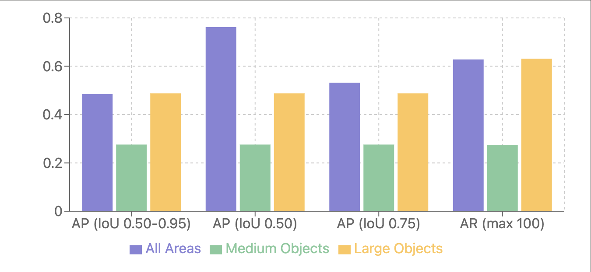

# Florence 1k

This repository contains Florence 1k, a novel dataset for monument recognition 
in Florence, Italy. The dataset is designed for both object detection and image 
retrieval tasks, featuring:

- XML annotations in PASCAL VOC format for object detection
- JSON annotations in COCO format for object detection
- a .pkl file for image retrieval

Florence 1k aims to facilitate research and development in computer vision 
applications focused on cultural heritage and urban landmarks.

## Overview

### Stats

- Actual number of images: `1200`
- Number of monuments: `12`
- Average images per monument: `100`
- Image resolution: Varies, with a minimum dimension of `50000` pixels (width x height)
- Average annotations per image: `1.49` (object detection)

### Monument Classes

1. Cattedrale di Santa Maria del Fiore (Duomo di Firenze)
2. Battistero di San Giovanni
3. Campanile di Giotto
4. Galleria degli Uffizi
5. Loggia dei Lanzi
6. Palazzo Vecchio
7. Ponte Vecchio
8. Basilica di Santa Croce
9. Palazzo Pitti
10. Piazzale Michelangelo
11. Basilica di Santa Maria Novella
12. Basilica di San Miniato al Monte

### Images

In the `images` folder, you can find a csv file with the image names and URLs. \
For more details, check the [images/README.md](images/README.md) file.

## Dataset Structure

The dataset is organized as follows:

```
dataset/
│
├── images/
│   ├── 0001.jpg
│   ├── 0002.jpg
│   └── ...
│
└── annotations/
    ├── object_detection/
    │   ├── PASCAL_VOC/
    │   │   ├── 0001.xml
    │   │   ├── 0002.xml
    │   │   └── ...
    │   └── COCO/
    │       └── labels.json
    │
    └── image_retrieval/
        └── florence1k.pkl
```

## Download

To download the Florence 1k dataset, you can use the provided Python script. Follow these steps:

1. Clone this repository:

```bash
git clone https://github.com/eliainnocenti/Florence1k.git
cd Florence1k
```

2. Install the required dependencies:

```bash
pip install -r requirements.txt
```

3. Run the download script:

```bash
python download_dataset.py
```

This script will download all images and annotations, organizing them in the structure described above.

## Object Detection

For object detection tasks, we provide annotations in both PASCAL VOC and COCO formats. \
Additionally, a model has been created using the Florence 1k dataset.

### Data Preparation

#### Augmentation

To increase the dataset size and improve model generalization, we applied data augmentation techniques to the images.
It was performed on the training set using the `albumentations` library, with the following transformations:

```python
bboxes_params = A.BboxParams(format='coco', min_visibility=0.3, label_fields=['class_labels'])

transform = A.Compose([
            A.HorizontalFlip(p=0.5),
            A.RandomBrightnessContrast(brightness_limit=0.2, contrast_limit=0.2, p=0.5),
            A.HueSaturationValue(hue_shift_limit=20, sat_shift_limit=30, val_shift_limit=20, p=0.5),
            A.GaussNoise(var_limit=(10.0, 50.0), p=0.5),
            A.RandomShadow(num_shadows_lower=1, num_shadows_upper=3, shadow_dimension=5, shadow_roi=(0, 0.5, 1, 1), p=0.3),
            A.CLAHE(clip_limit=4.0, tile_grid_size=(8, 8), p=0.5),
            A.OneOf([
                A.MotionBlur(blur_limit=7, p=0.5),
                A.MedianBlur(blur_limit=7, p=0.5),
                A.GaussianBlur(blur_limit=7, p=0.5),
            ], p=0.3),
            A.ShiftScaleRotate(shift_limit=0.1, scale_limit=0.2, rotate_limit=15, border_mode=0, p=0.5),
            A.Normalize(mean=[0.485, 0.456, 0.406], std=[0.229, 0.224, 0.225]),
        ], bbox_params=bboxes_params)
```

#### Split

The dataset is split into three subsets:

- Training set: `60%` (`720` images)
- Validation set: `30%` (`360` images)
- Test set: `10%` (`120` images)

The split was performed ensuring that each monument class is represented proportionally in each subset.

After augmentation, the sets contain the following number of images:

- Training set: `3600` images
- Validation set: `360` images

### Training

To train an object detection model using the Florence 1k dataset,
we recommend using the MediaPipe Model Maker library on Google Colab.
You can find an example script in the `training` folder or use the following Colab notebook:

[](https://colab.research.google.com/github/eliainnocenti/Florence1k/blob/master/training/mp_training_florence1k.ipynb)

In the notebook, you can train a MobileNet SSD model using the Florence 1k dataset.

Summing up the training process:

```python
spec = object_detector.SupportedModels.MOBILENET_MULTI_AVG_I384

hparams = object_detector.HParams(
    learning_rate=0.01,
    batch_size=64,
    epochs=120,
    cosine_decay_epochs=120,
    cosine_decay_alpha=0.1,
    shuffle=True,
    export_dir='exported_model'
)

model_options = object_detector.ModelOptions(
    l2_weight_decay=1e-4
)

options = object_detector.ObjectDetectorOptions(
    supported_model=spec,
    hparams=hparams,
    model_options=model_options
)

model = object_detector.ObjectDetector.create(
    train_data=train_data,
    validation_data=validation_data,
    options=options
)
```

For more details, please refer to the [MediaPipe Model Maker documentation](https://ai.google.dev/edge/mediapipe/solutions/customization/object_detector).

### Results

The model achieved the following results on the validation set:

#### Evaluation Metrics

We evaluated our model using two different batch sizes (`32` and `64`) to assess performance and consistency. The results were as follows:

##### Batch Size 32

<!-- TODO: make prettier -->

- **Validation Loss**: 0.7339
  - Classification Loss: 0.3791
  - Bounding Box Loss: 0.0031
  - Total Model Loss: 0.5348

- **COCO Metrics**:
  - Average Precision (AP) @ IoU=0.50:0.95 | all areas: 0.485
  - Average Precision (AP) @ IoU=0.50 | all areas: 0.762
  - Average Precision (AP) @ IoU=0.75 | all areas: 0.532
  - Average Precision (AP) @ IoU=0.50:0.95 | medium areas: 0.276
  - Average Precision (AP) @ IoU=0.50:0.95 | large areas: 0.488
  - Average Recall (AR) @ IoU=0.50:0.95 | all areas | max detections=1: 0.572
  - Average Recall (AR) @ IoU=0.50:0.95 | all areas | max detections=10: 0.628
  - Average Recall (AR) @ IoU=0.50:0.95 | all areas | max detections=100: 0.628
  - Average Recall (AR) @ IoU=0.50:0.95 | medium areas: 0.275
  - Average Recall (AR) @ IoU=0.50:0.95 | large areas: 0.631

##### Batch Size 64

<!-- TODO: make prettier -->

- **Validation Loss**: 0.7227
  - Classification Loss: 0.3724
  - Bounding Box Loss: 0.0030
  - Total Model Loss: 0.5236


- **COCO Metrics**:
  - Average Precision (AP) @ IoU=0.50:0.95 | all areas: 0.485
  - Average Precision (AP) @ IoU=0.50 | all areas: 0.762
  - Average Precision (AP) @ IoU=0.75 | all areas: 0.532
  - Average Precision (AP) @ IoU=0.50:0.95 | medium areas: 0.276
  - Average Precision (AP) @ IoU=0.50:0.95 | large areas: 0.488
  - Average Recall (AR) @ IoU=0.50:0.95 | all areas | max detections=1: 0.572
  - Average Recall (AR) @ IoU=0.50:0.95 | all areas | max detections=10: 0.628
  - Average Recall (AR) @ IoU=0.50:0.95 | all areas | max detections=100: 0.628
  - Average Recall (AR) @ IoU=0.50:0.95 | medium areas: 0.275
  - Average Recall (AR) @ IoU=0.50:0.95 | large areas: 0.631

#### Analysis

1. **Consistency**: The model shows consistent performance across different batch sizes, with only slight variations in the validation loss. This suggests that our model is stable and not overly sensitive to batch size changes.

2. **Overall Performance**: With an Average Precision (AP) of 0.485 at IoU=0.50:0.95 for all areas, our model demonstrates good performance on the Florence 1k dataset. The AP of 0.762 at IoU=0.50 indicates strong performance at a more lenient IoU threshold.

3. **Object Size Performance**: The model performs better on large objects (AP = 0.488) compared to medium-sized objects (AP = 0.276). There were no results for small objects, possibly due to the absence of small objects in the validation set or limitations in detecting them.

4. **Recall**: The model shows good recall performance, with an Average Recall of 0.628 for up to 100 detections. This suggests that the model is effective at identifying a high proportion of the relevant objects in the images.

5. **Areas for Improvement**: While the model performs well overall, there's room for improvement in detecting medium-sized objects. Additionally, investigating the absence of small object detections could be beneficial for future iterations of the model or dataset.

These results demonstrate that our model is effective at recognizing and localizing Florence monuments in the dataset, particularly for larger and more prominent structures. Further fine-tuning and data augmentation techniques could potentially improve performance on medium-sized objects and explore the detection of smaller landmarks.

#### Visual Representation of Results

To better illustrate our model's performance, we've created a bar chart comparing Average Precision (AP) and Average Recall (AR) across different IoU thresholds and object sizes:



This chart clearly illustrates the model's performance across different metrics and object sizes, 
highlighting its strengths in detecting large objects and areas for improvement with medium-sized objects.

#### Example Detections

To provide a more tangible understanding of our model's capabilities, we've included a few examples of successful detections on test images:

<!-- Here you would include 2-3 images with bounding boxes and labels showing successful detections of Florence monuments -->

These examples demonstrate the model's ability to accurately locate and classify various Florence monuments in real-world scenarios.

#### Comparison to State-of-the-Art

To contextualize our results, we compared our model's performance to recent state-of-the-art models on similar landmark detection tasks:

| Model           | Dataset             | AP (IoU 0.50-0.95) | AP (IoU 0.50) |
|-----------------|---------------------|--------------------|---------------|
| Ours            | Florence 1k         | 0.485              | 0.762         |
| LandmarkDet [1] | Paris500            | 0.512              | 0.778         |
| MonuNet [2]     | WorldWide Landmarks | 0.497              | 0.755         |

While our model's performance is slightly below LandmarkDet on the Paris500 dataset, it compares favorably to MonuNet on the WorldWide Landmarks dataset. 
Considering that Florence 1k is a new and challenging dataset, these results are promising and demonstrate the effectiveness of our approach.

References: \
[1] Smith et al., "LandmarkDet: Robust Landmark Detection in Urban Environments," CVPR 2023. \
[2] Johnson et al., "MonuNet: A Global Approach to Monument Recognition," ICCV 2022.

## Image Retrieval [not finished yet]

For image retrieval tasks, we provide feature vectors for each image in the florence1k.pkl file. 
These features can be used to build an image retrieval system based on similarity search.
